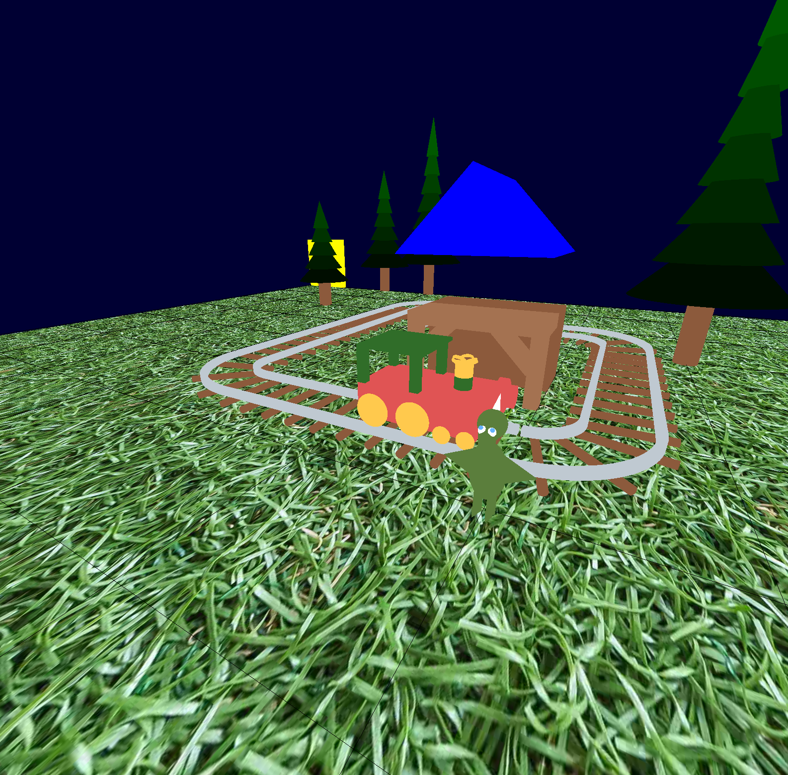

# Dino Train 🦖🚞

Projet réalisé par Benoît Baraille et Jade Riesen dans le cadre du cours de synthèse d'image - IMAC E3

# Résultat



# Compilation et exécution

## Lancement du programme

1. Compiler le projet.
2. Se rendre dans le répertoire `/bin`.
3. Exécuter la commande `./TD07_Train_ex01` en lui passant le chemin vers le fichier JSON en argument.

> **Remarque :** la prise en charge du chemin JSON est encore en cours de développement et n'est pas totalement fonctionnelle.

Le projet a été développé sous **macOS**, mais il est également prévu pour être compilé sous Windows et Linux.

## En cas de problème de compilation

Si la compilation échoue, vérifiez que les lignes **143 à 146** du fichier : `TD07_Train/ex01.cpp` sont bien commentées. (Normalement, ces lignes devraient déjà être commentées.)

# Commandes utilisateur

## Déplacements de la caméra

| Touche | Action                               |
| ------ | ------------------------------------ |
| ↑      | Avancer la caméra                    |
| ↓      | Reculer la caméra                    |
| ←      | Déplacer la caméra vers la gauche    |
| →      | Déplacer la caméra vers la droite    |
| D      | Rotation de la caméra vers la droite |
| S      | Rotation de la caméra vers la gauche |

## Modes d'affichage

| Touche | Action                                        |
| ------ | --------------------------------------------- |
| L      | Affichage en mode fil de fer (Wireframe)      |
| P      | Affichage en mode plein (Filled)              |
| Espace | Lancement de l'animation du bras du dinosaure |

## Modes d'éclairage

| Touche | Action                     |
| ------ | -------------------------- |
| B      | Activer l'ombrage de Phong |
| F      | Activer l'ombrage Flat     |

## Quitter l'application

| Touche     | Action               |
| ---------- | -------------------- |
| Echap ou Q | Fermer l'application |

# Fonctionnalités implémentées

- Caméra de type FPS.
- Suivi d'un trajet défini à partir d'un fichier JSON.
- Génération de rails droits et courbés conformément au cahier des charges.
- Création d'un train inspiré de l'univers Dino Train.
- Gestion de l'éclairage de la scène.
- Modélisation d'une gare.
- Création d'un dinosaure inspiré du _Tiny Pteranodon_ de Dino Train.
- Ajout d'une texture d'herbe sur le terrain.

## Améliorations

- Génération d'arbres avec tailles et positions aléatoires.

## Changement JSON

```json
{
  "size_grid": 10,
  "origin": [-1, 0],
  "arbres": 10,
  "dinosaure": [1, 1, -90],
  "path": [
    [0, -1],
    [0, -2],
    [-1, -2],
    [-2, -2],
    [-3, -2],
    [-4, -2],
    [-4, -1],
    [-3, -1],
    [-3, 0],
    [-3, 1],
    [-2, 1],
    [-1, 1],
    [0, 1],
    [0, 0]
  ]
}
```

Vous pouvez désormais ajouter la position du dinosaure ainsi que le nombre d’arbres souhaité.

# Merci !


